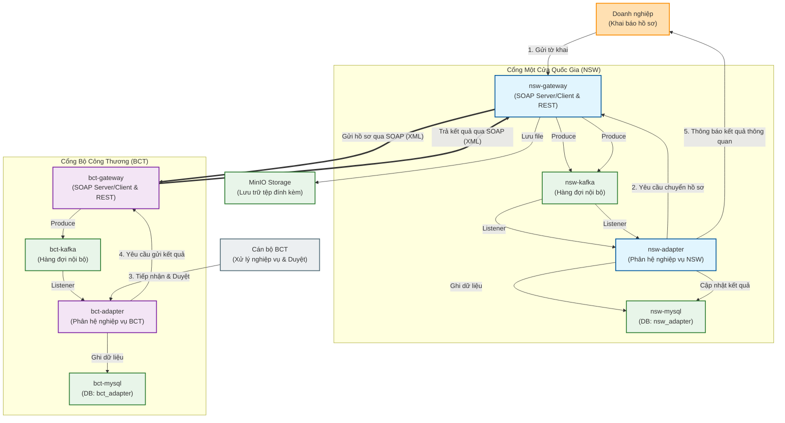
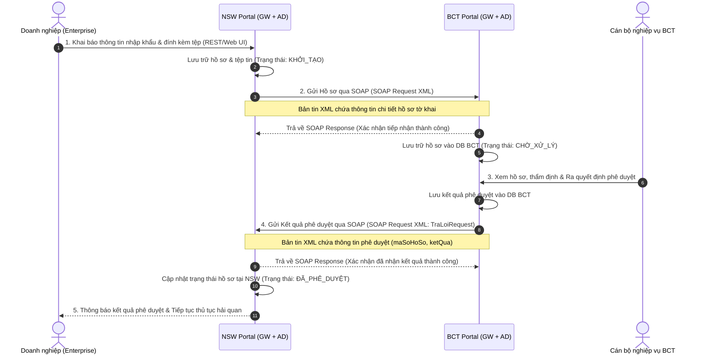
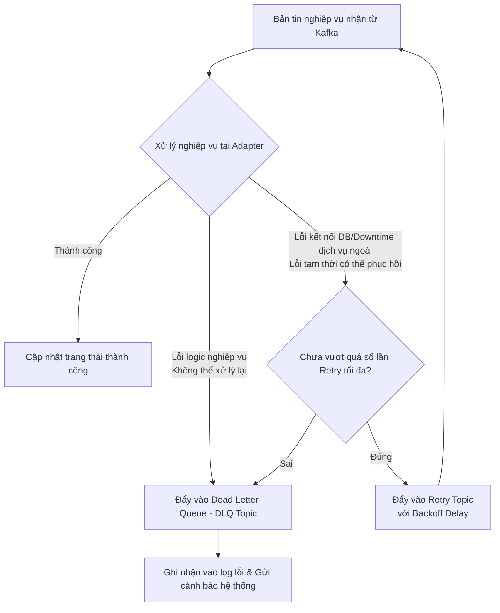
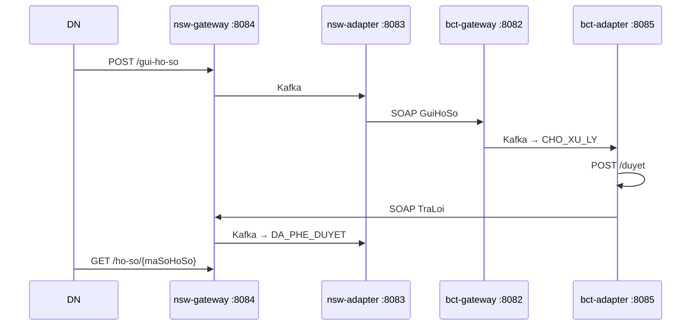

# Mô hình giao tiếp & Quy trình nghiệp vụ liên thông (Business Communication Model)

Hệ thống được thiết kế để mô phỏng quy trình nghiệp vụ liên thông hai chiều giữa **Cổng Một cửa Quốc gia (NSW Portal)** và **Cổng dịch vụ của Bộ/Ngành (ví dụ: Bộ Công Thương - BCT Portal)** để xử lý hồ sơ thủ tục hành chính.

## 1. Mô tả kịch bản nghiệp vụ liên thông

Quy trình phối hợp nghiệp vụ giữa Doanh nghiệp, NSW và BCT diễn ra như sau:
1. **Khai báo hồ sơ:** Doanh nghiệp truy cập cổng NSW thực hiện khai báo thông tin hồ sơ nhập khẩu và đính kèm các tệp tin (qua REST API/Web UI).
2. **Tiếp nhận & Chuyển tiếp hồ sơ:** Cổng NSW tiếp nhận, lưu trữ thông tin và tự động gửi thông tin hồ sơ sang cổng BCT bằng giao thức **SOAP (bản tin XML)** qua HTTP.
3. **Xử lý hồ sơ:** Cán bộ bên cổng BCT tiếp nhận hồ sơ, thực hiện kiểm tra nghiệp vụ trên phần mềm nghiệp vụ BCT và ra quyết định phê duyệt/từ chối.
4. **Trả kết quả xử lý:** Sau khi có kết quả phê duyệt, hệ thống BCT tự động gửi bản tin **SOAP (XML)** chứa kết quả xử lý quay trở lại cổng NSW.
5. **Thông quan hàng hóa:** Cổng NSW cập nhật trạng thái hồ sơ và trả kết quả cho Doanh nghiệp để tiếp tục thực hiện các thủ tục thông quan hải quan.

---

## 2. Mô hình kiến trúc kết nối giữa các Cổng và Phân hệ Nghiệp vụ

Dưới đây là mô hình chi tiết mô tả sự tương tác giữa các phần mềm nghiệp vụ bên trong và giao tiếp SOAP/XML giữa hai cổng:



---

## 3. Quy trình trao đổi bản tin SOAP/XML tuần tự (Sequence Flow)

Biểu đồ tuần tự dưới đây biểu diễn chi tiết các bước truyền nhận bản tin giữa hai cổng từ lúc doanh nghiệp khai báo cho tới khi nhận kết quả thông quan:



---

## 4. Đặc tả thông tin SOAP Endpoints & Cách kiểm thử nhanh

### Cấu hình SOAP Endpoints
| Cổng nhận | SOAP Endpoint | WSDL URL (Nginx/Dev) | Target Namespace | Request Payload |
| :--- | :--- | :--- | :--- | :--- |
| **NSW Gateway** | `/web-services/bct-thu-tuc-1` | `http://localhost/nsw-gateway/web-services/bct-thu-tuc-1.wsdl` | `thutuc1.bct.xsd.nsw_gateway.vn2bs.com` | `<TraLoiRequest>` |
| **NSW Gateway** | `/web-services/bct-messages` | `http://localhost/nsw-gateway/web-services/bct-messages.wsdl` | `com.vn2bs.webservices.bct.messages` | - |

### Ví dụ bản tin SOAP/XML gửi kết quả phê duyệt từ BCT sang NSW
Để giả lập cổng **BCT** gửi kết quả phê duyệt sang **NSW** (bước số 4 trong quy trình nghiệp vụ), bạn có thể chạy lệnh `cURL` sau:

```bash
curl -X POST \
  http://localhost/nsw-gateway/web-services \
  -H "Content-Type: text/xml" \
  -d '<soapenv:Envelope xmlns:soapenv="http://schemas.xmlsoap.org/soap/envelope/" xmlns:tns="thutuc1.bct.xsd.nsw_gateway.vn2bs.com">
   <soapenv:Header/>
   <soapenv:Body>
      <tns:TraLoiRequest>
         <tns:maSoHoSo>BCT-2026-0001</tns:maSoHoSo>
         <tns:ketQua>Phe duyet ho so thanh cong. Du dieu kien thong quan.</tns:ketQua>
      </tns:TraLoiRequest>
   </soapenv:Body>
</soapenv:Envelope>'
```

**Bản tin phản hồi thành công nhận được từ NSW (SOAP Response):**

```xml
<SOAP-ENV:Envelope xmlns:SOAP-ENV="http://schemas.xmlsoap.org/soap/envelope/">
   <SOAP-ENV:Header/>
   <SOAP-ENV:Body>
      <ns2:TraLoiResponse xmlns:ns2="thutuc1.bct.xsd.nsw_gateway.vn2bs.com">
         <ns2:maSoHoSo>BCT-2026-0001</ns2:maSoHoSo>
         <ns2:ketQua>success</ns2:ketQua>
      </ns2:TraLoiResponse>
   </soapenv:Body>
</SOAP-ENV:Envelope>
```

---

## 5. Cơ chế đảm bảo tính nhất quán dữ liệu và xử lý lỗi (Data Consistency & Error Handling)

Trong môi trường thực tế, việc trao đổi bản tin nghiệp vụ giữa **NSW** và **BCT** dễ gặp phải các sự cố như: mất kết nối mạng, dịch vụ phía nhận bị downtime, lỗi xác thực chữ ký số, hoặc lỗi logic nghiệp vụ dẫn đến trạng thái hồ sơ bị lệch giữa hai bên (ví dụ: NSW ghi nhận hồ sơ đã gửi nhưng BCT chưa nhận được, hoặc BCT đã duyệt nhưng NSW chưa cập nhật kết quả).

Dự án áp dụng các cơ chế sau để kiểm soát và giải quyết các lỗi trên:

### 5.1. Cơ chế Retry và xử lý hàng đợi qua Kafka (Kafka Consumer Retry & DLQ)

Khi nhận bản tin nghiệp vụ (SOAP XML) thành công ở Gateway, bản tin được lưu vào cơ sở dữ liệu và đẩy vào hàng đợi **Kafka** để xử lý bất đồng bộ ở tầng **Adapter** nhằm tránh nghẽn luồng HTTP. Khi tầng Adapter xử lý gặp lỗi, hệ thống áp dụng cơ chế phân loại lỗi và xử lý lại:



*   **Lỗi tạm thời (Transient Errors - ví dụ: Mất kết nối database tạm thời, dịch vụ phụ trợ downtime):** Bản tin được chuyển sang **Retry Topic** để xử lý lại với cơ chế **Exponential Backoff** (tăng dần thời gian giãn cách giữa các lần retry) nhằm tránh làm quá tải hệ thống nhận.
*   **Lỗi không thể phục hồi (Non-recoverable Errors - ví dụ: Sai định dạng dữ liệu, sai schema XSD, lỗi chữ ký số không hợp lệ):** Bản tin sẽ được đẩy thẳng vào **Dead Letter Queue (DLQ Topic)**. Việc này đảm bảo hàng đợi chính không bị tắc nghẽn (Head-of-Line Blocking).
*   **Giám sát DLQ:** Các kỹ sư vận hành có thể giám sát DLQ, phân tích nguyên nhân lỗi, sửa đổi dữ liệu hoặc cấu hình và phát lại bản tin (Replay Message) khi dịch vụ ổn định.

### 5.2. Quản lý bản tin gửi/nhận bằng Mã giao dịch duy nhất (Correlation ID & Message Transaction Log)

Để tránh tình trạng mất mát thông tin và phục vụ đối soát, toàn bộ vòng đời của một hồ sơ hành chính được theo dõi qua:

1.  **Correlation ID (Mã định danh giao dịch):**
    *   Mỗi khi Doanh nghiệp khởi tạo hồ sơ, hệ thống tự động sinh một mã định danh duy nhất (`Correlation ID` hay `Message ID`).
    *   Mã này được đính kèm vào SOAP Header của tất cả các bản tin XML và là khóa chính để ghi nhận thông tin trong Kafka Message Header cũng như logs của các dịch vụ.
2.  **Nhật ký giao dịch bản tin (Message Transaction Log):**
    *   Bảng `message_log` được xây dựng ở cả 2 cơ sở dữ liệu (`nsw_adapter` và `bct_adapter`) để ghi nhận lịch sử gửi/nhận:
        *   `message_id`, `correlation_id`, `sender`, `receiver`, `message_type` (Gửi hồ sơ / Trả kết quả).
        *   `payload_xml` (Nội dung XML gốc để phục vụ đối chiếu/pháp lý).
        *   `status` (`SENT`, `RECEIVED`, `PROCESSED_SUCCESS`, `PROCESSED_FAILED`).
        *   `error_detail` (Chi tiết lỗi khi xử lý thất bại).
    *   Trước khi xử lý bản tin mới nhận, hệ thống kiểm tra trạng thái trong `message_log` dựa trên `correlation_id` để tránh việc xử lý lặp lại (Idempotency Control).

### 5.3. Kiểm soát dịch chuyển trạng thái (State Machine Control)

*   Hệ thống quy định máy trạng thái (State Machine) chặt chẽ cho hồ sơ. 
*   Ví dụ: Trạng thái hồ sơ tại NSW chỉ được chuyển từ `CHỜ_PHÊ_DUYỆT` sang `ĐÃ_PHÊ_DUYỆT` khi nhận được bản tin SOAP hợp lệ có chữ ký số xác nhận từ BCT. 
*   Các bản tin đến sai thứ tự hoặc có trạng thái không hợp lệ với logic nghiệp vụ hiện tại (ví dụ: nhận bản tin trả kết quả cho một hồ sơ đang ở trạng thái `ĐÃ_HỦY`) sẽ bị từ chối ngay lập tức tại tầng Gateway và ghi log cảnh báo lệch trạng thái.

### 5.4. Cơ chế Đối soát định kỳ (Reconciliation Engine)

*   Cuối mỗi ngày hoặc theo chu kỳ quy định, một tiến trình chạy ngầm (Reconciliation Job) sẽ thực hiện đối soát tự động danh sách các hồ sơ đang xử lý giữa hai cổng.
*   Tiến trình này sẽ so sánh trạng thái của các hồ sơ có cùng `correlation_id` giữa hai cơ sở dữ liệu `nsw_adapter` và `bct_adapter`.
*   Nếu phát hiện sự không đồng nhất về trạng thái (ví dụ: Bên BCT đã phê duyệt được 2 giờ nhưng bên NSW vẫn ở trạng thái `CHỜ_PHÊ_DUYỆT`), hệ thống sẽ phát tín hiệu cảnh báo (Discrepancy Alert) và tự động kích hoạt tiến trình gửi lại kết quả (Auto-Replay) từ BCT sang NSW để đồng bộ trạng thái.

---

# Hướng dẫn phát triển dự án NSW

Tài liệu này hướng dẫn chi tiết cách cài đặt môi trường, chạy debug và sử dụng các công cụ phát triển cho dự án.

## 1. Cài đặt môi trường (Environment Setup)

Trước khi bắt đầu, hãy đảm bảo máy tính của bạn đã cài đặt các công cụ sau:

### 1.1. Java Development Kit (JDK)
*   **Phiên bản**: Java 21
*   **Tải xuống**: [Adoptium Temurin 21](https://adoptium.net/) hoặc Oracle JDK 21.
*   **Kiểm tra**:
    ```bash
    java -version
    ```

### 1.2. Docker & Docker Compose
*   **Docker Desktop**: Tải và cài đặt từ [Docker Hub](https://www.docker.com/products/docker-desktop).
*   **Kiểm tra**:
    ```bash
    docker --version
    docker-compose --version
    ```

### 1.3. Maven (Tùy chọn)
*   Dự án thường sử dụng Maven Wrapper (`mvnw`), nhưng bạn có thể cài đặt Maven 3.9+ nếu muốn dùng global command.

---

## 2. Khởi chạy môi trường (Launch Environment)

Sử dụng `docker-compose` để khởi chạy các dịch vụ phụ trợ (Database, Kafka, MinIO).

### Lệnh khởi chạy
Tại thư mục gốc của dự án, chạy lệnh:

```bash
docker-compose -f docker-compose.dev.yml up -d
```

### Thông tin dịch vụ
| Dịch vụ | Container Name | Port (Host:Container) | Thông tin đăng nhập (nếu có) |
| :--- | :--- | :--- | :--- |
| **Kafka (NSW)** | `nsw-kafka` | `9092:9092` | - |
| **Kafka (BCT)** | `bct-kafka` | `9093:9092` | - |
| **MySQL (NSW)** | `nsw-mysql` | `3316:3306` | Root Pass: `rootpassword`, DB: `nsw_adapter` |
| **MySQL (BCT)** | `bct-mysql` | `3326:3306` | Root Pass: `rootpassword`, DB: `bct_adapter` |
| **MinIO** | `minio` | `9000:9000` (API), `9001:9001` (Console) | User: `minioadmin`, Pass: `minioadmin` |

---

## 3. Hướng dẫn Debug

### 3.1. Debug `nsw-gateway`

#### Cách 1: Command Line (Chạy trực tiếp)
```bash
cd nsw-gateway
mvn spring-boot:run
```
Lưu ý: Để debug qua CLI, bạn cần cấu hình JVM options (như `-agentlib:jdwp...`). Khuyên dùng IDE để thuận tiện hơn.

#### Cách 2: Visual Studio Code
1.  Mở tab **Run and Debug** (Ctrl+Shift+D).
2.  Chọn cấu hình **"NSW Gateway"** (đã được cấu hình trong `.vscode/launch.json`).
3.  Nhấn **F5** để bắt đầu debug.

#### Cách 3: IntelliJ IDEA
1.  Mở Project.
2.  Tạo Configuration mới -> chọn **Spring Boot**.
3.  Main class: `com.vn2bs.nsw_gateway.NswGatewayApplication`.
4.  Nhấn biểu tượng **Debug** (con bọ).

### 3.2. Debug `nsw-adapter`

#### Cách 1: Command Line
```bash
cd nsw-adapter
mvn spring-boot:run
```

#### Cách 2: Visual Studio Code
1.  Mở tab **Run and Debug**.
2.  Chọn cấu hình **"NSW Adapter"**.
3.  Nhấn **F5**.

#### Cách 3: IntelliJ IDEA
1.  Tạo Configuration mới -> chọn **Spring Boot**.
2.  Main class: `com.vn2bs.nsw_adapter.NswAdapterApplication`.
3.  Nhấn biểu tượng **Debug**.

---

## 4. Hướng dẫn Công cụ phát triển

### 4.1. Tạo Changelog với Liquibase
Dự án sử dụng Liquibase để quản lý version database. Để tạo changelog tự động từ sự thay đổi của entity:

1.  Đảm bảo database đang chạy.
2.  Chạy lệnh sau tại module tương ứng (`nsw-gateway`, `nsw-adapter`, v.v.):
    ```bash
    mvn liquibase:generateChangeLog
    ```
3.  File changelog mới sẽ được tạo tại đường dẫn được cấu hình trong `pom.xml` (thường là `src/main/resources/config/liquibase/changelog/`).

### 4.2. Tạo dữ liệu từ XSD với JAXB2
Để sinh các class Java từ file XSD (XML Schema Definition):

1.  Đảm bảo các file `.xsd` đã được đặt đúng vị trí (ví dụ: `src/main/resources/xsd/`).
2.  Chạy lệnh:
    ```bash
    mvn jaxb2:xjc
    ```
3.  Source code sẽ được gen vào thư mục cấu hình (ví dụ: `src/main/java`).

---

## 5. Cấu trúc dự án
*   **common**: Thư viện dùng chung.
*   **nsw-gateway**: Cổng giao tiếp xử lý nghiệp vụ hải quan.
*   **nsw-adapter**: Adapter kết nối với hệ thống hải quan.
*   **bct-gateway**: Cổng giao tiếp Bộ Công Thương.
*   **bct-adapter**: Adapter kết nối Bộ Công Thương.

---

## 6. Demo E2E MVP (G3)

Luồng happy path end-to-end: **DN nộp hồ sơ → BCT duyệt → DN tra cứu kết quả**.



### 6.1. Ports ứng dụng (local dev)

| Module | Port | DB | Kafka |
|--------|------|-----|-------|
| nsw-gateway | **8084** | `localhost:3316` / `nsw_adapter` | `9092` |
| nsw-adapter | **8083** | `localhost:3316` / `nsw_adapter` | `9092` |
| bct-gateway | **8082** | `localhost:3326` / `bct_adapter` | `9093` |
| bct-adapter | **8085** | `localhost:3326` / `bct_adapter` | `9093` |

Swagger UI:
- NSW: `http://localhost:8084/swagger-ui.html`
- BCT cán bộ: `http://localhost:8085/swagger-ui.html`

### 6.2. Khởi động

**Bước 1 — Infra** (tại thư mục gốc dự án):

```bash
docker compose -f docker-compose.dev.yml up -d nsw-kafka bct-kafka nsw-mysql bct-mysql minio
```

**Bước 2 — Build** (sau khi pull code mới):

```bash
mvn -pl nsw-gateway,nsw-adapter,bct-gateway,bct-adapter -am clean install -DskipTests=false
```

**Bước 3 — 4 service** (4 terminal, tại thư mục gốc):

```bash
mvn -pl nsw-gateway spring-boot:run    # 8084
mvn -pl nsw-adapter spring-boot:run    # 8083
mvn -pl bct-gateway spring-boot:run    # 8082
mvn -pl bct-adapter spring-boot:run    # 8085
```

**Kiểm tra health** (cả 4 phải trả HTTP 200):

```bash
curl -s http://localhost:8084/actuator/health
curl -s http://localhost:8083/actuator/health
curl -s http://localhost:8082/actuator/health
curl -s http://localhost:8085/actuator/health
```

### 6.3. Script tự động

```bash
./scripts/e2e-demo.sh
```

Script kiểm tra 4 service, nộp hồ sơ, chờ Kafka, duyệt BCT, tra cứu NSW và assert `DA_PHE_DUYET`.

### 6.4. Test thủ công (curl)

```bash
# 1. Nộp hồ sơ
curl -s -X POST http://localhost:8084/nsw/thu-tuc-1/gui-ho-so \
  -F 'thongTin={"tenNguoiGui":"Cong ty ABC"};type=application/json'

# 2. (sau ~15s) List CHO_XU_LY tại BCT — thay {MA} bằng maSoHoSo
curl -s "http://localhost:8085/bct/thu-tuc-1/ho-so?status=CHO_XU_LY"

# 3. Duyệt
curl -s -X POST "http://localhost:8085/bct/thu-tuc-1/ho-so/{MA}/duyet" \
  -H 'Content-Type: application/json' \
  -d '{"tenNguoiXuLy":"Can bo A","ketQua":"Phe duyet ho so thanh cong"}'

# 4. (sau ~5s) Tra cứu NSW
curl -s "http://localhost:8084/nsw/thu-tuc-1/ho-so/{MA}"
```

Kỳ vọng bước 4: `"businessStatus":"DA_PHE_DUYET"` và `ketQua` có nội dung phê duyệt.

### 6.5. Postman

Import collection: [`docs/postman/NSW-BCT-E2E.postman_collection.json`](docs/postman/NSW-BCT-E2E.postman_collection.json)

Chạy theo thứ tự folder **0 → 4** hoặc dùng **Collection Runner**. Chi tiết: [`docs/postman/README.md`](docs/postman/README.md).

### 6.6. Xử lý lỗi thường gặp

| Triệu chứng | Nguyên nhân | Cách xử lý |
|-------------|-------------|------------|
| `HTTP 000` / script dừng im | Service chưa chạy | Khởi động đủ 4 app, kiểm tra `/actuator/health` |
| `UnknownHostException: nsw-kafka` | Kafka advertise sai hostname | Dùng `docker-compose.dev.yml` (localhost), recreate Kafka |
| List BCT rỗng | Kafka chưa consume | Đợi 15s; kiểm tra nsw-adapter + bct-adapter log |
| `No enum constant CHO_XU_LY` | Chạy bản cũ chưa rebuild | `mvn clean install` rồi restart app |
| `businessStatus must be CHO_XU_LY` | Duyệt khi hồ sơ chưa CHO_XU_LY | Gửi hồ sơ mới hoặc đợi adapter consume |
